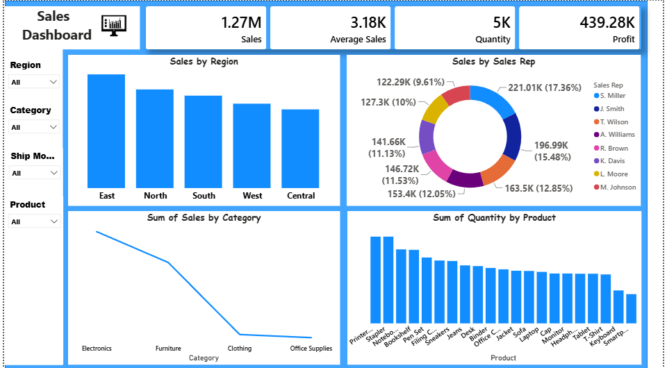

# Sales Dashboard (Excel + Power BI)

A sales analytics project: formulas practiced and data prepared in Excel, then imported into Power BI to build a fully interactive dashboard.

## Overview
This project tracks key sales metrics — total sales, profit, quantity sold, and average sales — with breakdowns by region, sales rep, product, and category, visualized through an interactive Power BI report.

## Workflow
1. **Excel** — practiced and applied formulas across the raw sales dataset (SUM, VLOOKUP, INDEX/MATCH, SUMPRODUCT, Pivot Tables, and more)
2. **Power BI** — imported the cleaned dataset and built an interactive dashboard with KPI cards, charts, and filters

## Features
- KPI Summary Cards: Total Sales (1.27M), Profit (439.28K), Quantity (5K), Average Sales (3.18K)
- Sales by Region (bar chart)
- Sales by Sales Rep (donut chart)
- Sum of Quantity by Product (bar chart)
- Sum of Sales by Category (line chart)
- Interactive filters: Region, Category, Ship Mode, Product

## Techniques Practiced in Excel
- Basic: SUM, AVERAGE, COUNT, IF, text & date functions
- Intermediate: COUNTIFS, SUMIFS, VLOOKUP, nested IF
- Advanced: INDEX/MATCH, SUMPRODUCT, RANK, running totals, Pivot Tables

## Files
- `Cleaned data.xlsx` — dataset with formulas applied
- `Excel_PowerBI_Practice_Dataset.xlsx` — full formula practice workbook
- `live.pbix` — Power BI dashboard file

## How to View
Open `live.pbix` in Power BI Desktop to explore the interactive filters and drill into Region, Category, Ship Mode, or Product.

## Screenshot

