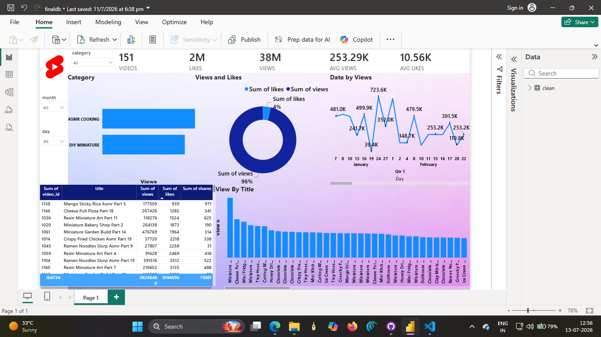

# Sales Dashboard (Excel + Power BI)

A sales analytics project: formulas practiced and data prepared in Excel, then imported into Power BI to build a fully interactive dashboard.

## Overview
This project tracks key sales metrics — total sales, profit, order count, and average order value — with breakdowns by region and product category, visualized through an interactive Power BI report.

## Workflow
1. **Excel** — practiced and applied formulas across the raw sales dataset (SUM, VLOOKUP, INDEX/MATCH, SUMPRODUCT, Pivot Tables, and more)
2. **Power BI** — imported the cleaned dataset and built an interactive dashboard with KPI cards, charts, and slicers

## Features
- KPI Summary Cards: Total Sales, Total Profit, Total Orders, Avg Order Value
- Region-wise sales breakdown
- Category-wise sales share
- Interactive filters/slicers
- Dynamic charts that update together on selection

## Techniques Practiced in Excel
- Basic: SUM, AVERAGE, COUNT, IF, text & date functions
- Intermediate: COUNTIFS, SUMIFS, VLOOKUP, nested IF
- Advanced: INDEX/MATCH, SUMPRODUCT, RANK, running totals, Pivot Tables

## Files
- `Cleaned data.xlsx` — dataset with formulas applied
- `Excel_PowerBI_Practice_Dataset.xlsx` — full formula practice workbook
- `live.pbix` — Power BI dashboard file

## Screenshot

